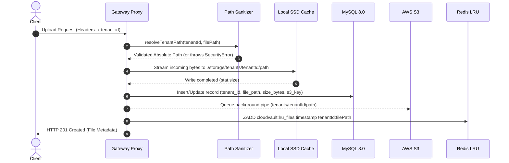
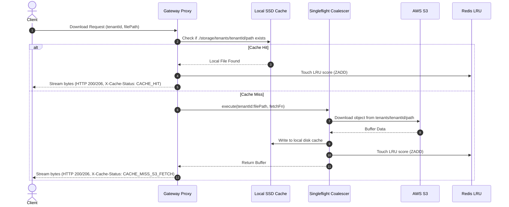
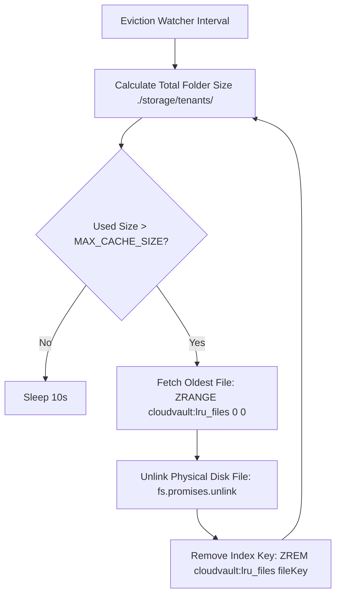

# 🏛️ CloudVault Architecture & Implementation Deep Dive

This document provides a comprehensive, step-by-step engineering breakdown of how **CloudVault** operates as a Multi-Tenant Hybrid-Cloud Storage Gateway & Reverse Proxy for AWS S3.

---

## 1. System Overview

CloudVault sits as an on-premises or edge gateway in front of AWS S3. It maintains:
- **Local NVMe/SSD Storage (`./storage/tenants/<tenantId>/`)** for fast cache hits.
- **MySQL 8.0 Relational Database** for persistent file metadata & tenant access control.
- **Redis In-Memory Data Store (`ZSET cloudvault:lru_files`)** for LRU eviction scoring.
- **Singleflight Request Coalescer** to resolve cache misses efficiently.

---

## 2. End-to-End Execution Workflows

### 📥 A. Upload Workflow (`POST /upload` or `PUT /proxy/:tenantId/*`)



1. **Request Intake:** Client sends file via `POST /api/v1/gateway/upload` or transparent `PUT /proxy/:tenantId/path/to/file`.
2. **Security & Boundary Validation:** `resolveTenantPath(tenantId, userRequestedPath)` resolves the absolute path and verifies it strictly resides under `./storage/tenants/<tenantId>/`. Throws `SecurityError` (HTTP 403) on path traversal (`../`) attempts.
3. **Local Write-Through Stream:** Incoming HTTP request body streams directly into target local storage path using Node.js `stream/promises` `pipeline`.
4. **Metadata Recording:** Inserts/updates file record in MySQL `files` table (`tenant_id`, `file_path`, `file_name`, `size_bytes`, `s3_key`).
5. **Background S3 Sync:** Non-blocking background worker pipes file to S3 (`uploadFileToS3`).
6. **LRU Scoring:** Calls `touchFile(redis, `${tenantId}:${filePath}`)` to set Redis ZSET score to `Date.now()`.

---

### 📤 B. Download Workflow (`GET /download` or `GET /proxy/:tenantId/*`)



1. **Cache Inspection:** Proxy checks local SSD disk for `./storage/tenants/<tenantId>/<filePath>`.
2. **Cache Hit Path (3.8ms):**
   - File exists locally. Proxy updates Redis LRU score and streams bytes directly back to client with HTTP 200/206 and `X-Cache-Status: CACHE_HIT`.
3. **Cache Miss Path (Singleflight S3 Fetch):**
   - File missing locally. Request joins `singleflightExecute(`${tenantId}:${filePath}`, fetchFn)`.
   - If 20 concurrent requests arrive simultaneously for the missing file, **only 1 S3 download request** executes.
   - S3 buffer is written to local SSD disk, indexed in Redis LRU, and returned to all waiting requests.

---

### 🧹 C. Redis LRU Eviction Watcher Workflow



- Background interval worker (`startEvictionWatcher`) continuously monitors `./storage/tenants/`.
- If disk usage exceeds `MAX_CACHE_SIZE_BYTES`, it queries Redis for the lowest score (oldest accessed file), deletes it from SSD, and updates Redis.

---

## 🔒 3. Multi-Tenant Security Matrix

| Threat Vector | Defense Mechanism | Implementation |
| :--- | :--- | :--- |
| **Path Traversal (`../`)** | Path Sanitizer | `resolveTenantPath` with `path.normalize` & `path.resolve` check. |
| **Cross-Tenant Data Read** | Database Partitioning | MySQL metadata queries strictly filter `WHERE tenant_id = ?`. |
| **S3 Credential Leakage** | Reverse Proxy Shielding | AWS credentials remain server-side; S3 bucket is 100% private. |
| **Thundering Herd Overload** | Request Coalescing | `singleflightService` merges concurrent S3 requests. |

---

## 👨‍💻 Verification & Test Commands

Run the full automated test suite verifying all architectural components:

```bash
npm test
```
