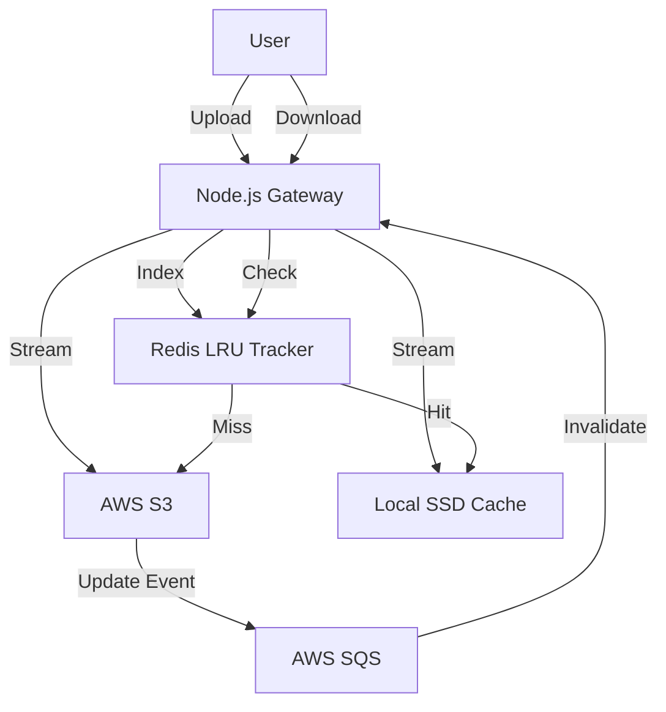

# 🚀 CloudVault: Distributed Hybrid-Cloud Storage Gateway


**CloudVault** is a high-performance **Storage Gateway** that acts as an intelligent caching layer between users and AWS S3. It minimizes cloud egress costs and latency by implementing a **Write-Through Cache** and **LRU Eviction Policy**, backed by Redis and local NVMe storage.

It features an **Event-Driven Architecture** using AWS SQS to automatically invalidate stale cache when files are modified directly in the cloud.

---

## 🏗️ System Architecture




## ✨ Key Features

* **⚡ Smart Caching:** Serves frequently accessed files from local disk (5ms latency) instead of fetching from S3 (200ms+ latency).
* **🔄 Dual-Stream Uploads:** Pipes data to S3 and Local Disk simultaneously using Node.js Streams for non-blocking I/O.
* **🧹 Automatic Eviction (LRU):** Monitors disk usage. When the cache fills up (e.g., >100MB), it automatically deletes the *Least Recently Used* files to make space.
* **📡 Event-Driven Invalidation:** Listens to AWS SQS queues. If a file is deleted/updated in the S3 Console, the system instantly removes the stale local copy.
* **🐳 Fully Dockerized:** One-click deployment for App, Postgres, and Redis using Docker Compose.

---

## 🛠️ Tech Stack

* **Backend:** Node.js (Express), Streams API
* **Database:** PostgreSQL (Metadata), Redis (Cache Indexing & LRU Scoring)
* **Cloud:** AWS S3 (Storage), AWS SQS (Event Queue)
* **Infrastructure:** Docker, Docker Compose
* **Frontend:** Simple HTML/JS Dashboard for Latency Testing

---


1. Clone the Repository
```bash
git clone [https://github.com/vinay020606/cloudvault-node.git](https://github.com/vinay020606/cloudvault-node.git)
cd cloudvault-node
2. Configure Environment
Create a .env file in the root directory:

Code snippet
PORT=3000

# Infrastructure
DB_HOST=postgres
DB_USER=user
DB_PASSWORD=password
DB_NAME=cloudvault
REDIS_HOST=redis

# AWS Credentials
AWS_REGION=ap-south-1
AWS_ACCESS_KEY_ID=your_access_key
AWS_SECRET_ACCESS_KEY=your_secret_key
AWS_BUCKET_NAME=your_bucket_name
AWS_SQS_QUEUE_URL=your_sqs_url
3. Run with Docker
Bash
cd deploy
docker-compose up --build
4. Access the Dashboard
Open your browser to http://localhost:3000.

Upload: Drag & drop a file to test the dual-stream upload.

Download: Click a file to see "Cache Hit" speeds.

Test Invalidation: Delete a file in AWS S3 Console and watch it disappear from your local list.

🧪 Testing the System
1. The Speed Test
First Download (Cache Miss): Fetches from S3.

Log: ☁️ CACHE MISS: Fetching from S3...

Second Download (Cache Hit): Serves from Disk.

Log: 🚀 CACHE HIT: Serving from NVMe/Disk

2. The Eviction Test
Set MAX_CACHE_SIZE in src/services/evictionService.js to 10MB.

Upload three 5MB files.

Observe that the first file is automatically deleted from uploads/ to make room for the third.

🔮 Future Improvements
CDN Integration: Place CloudFront in front of the gateway for global edge caching.

Request Coalescing: If 100 users request the same "Cache Miss" file simultaneously, download it once and stream to all.

Sharded Caching: Distribute cache across multiple Docker containers using Consistent Hashing.
The system operates as a Hybrid Gateway linking your local computer to the AWS Cloud.

A. The Data Plane (File Movement)
Write-Through Stream: When you upload, data is split into two streams:

Stream A: Writes to local src/uploads/ (Immediate access).

Stream B: Pipes directly to AWS S3 (Long-term backup).

Read-Through Cache: When you download:

Check Redis: "Do we have this file locally?"

Hit: Serve from src/uploads/ (5ms).

Miss: Download from S3 → Save to src/uploads/ → Serve to user.

B. The Control Plane (Management)
Redis (The Index): Keeps a list of every file in the local cache, sorted by "Last Accessed Time."

LRU Eviction Service: A background watcher. If src/uploads/ exceeds 100MB, it asks Redis: "Who is the least popular file?" and deletes it to make room.

SQS Listener (The Ear): A background worker in server.js. It constantly listens to AWS. If you delete a file in the S3 Console, SQS shouts "Invalidate!", and the worker deletes the local copy.


Non-Blocking I/O: Using streams instead of fs.readFile means you can upload a 10GB video with only 50MB of RAM.

Event-Driven Consistency: Using SQS means your local cache is never "stale" (outdated).

Infrastructure as Code: The entire environment (Database, Cache, App) spins up with one command: docker-compose up.

👨‍💻 Author
S Vinay
