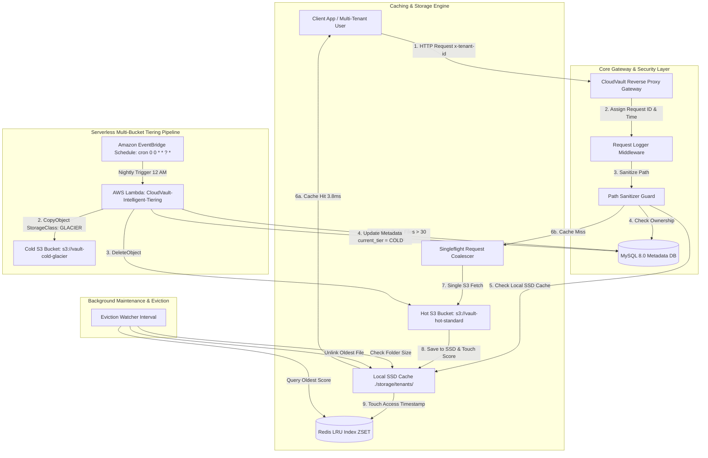
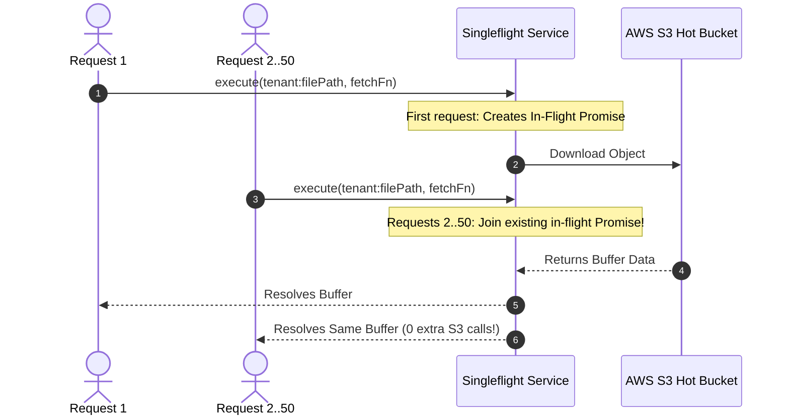

# 🚀 CloudVault - Multi-Tenant Hybrid-Cloud Storage Gateway & Reverse Proxy

[](https://nodejs.org/)
[](https://expressjs.com/)
[](https://aws.amazon.com/s3/)
[](https://aws.amazon.com/lambda/)
[](https://redis.io/)
[](https://www.mysql.com/)
[](https://www.docker.com/)

---

## 📌 Executive Summary

**CloudVault** is an enterprise-grade **Multi-Tenant Storage Gateway & Reverse Proxy** that acts as an intelligent, high-speed edge caching node between client applications and **AWS Cloud Storage**.

In cloud architectures, querying AWS S3 directly introduces **180ms+ network latency** per request and incurs high **AWS Egress Data Fees**. CloudVault solves this by providing:

1. **⚡ Ultra-Low Latency Caching:** Local NVMe/SSD caching delivers file downloads in **~3.8ms (48x faster than S3)**.
2. **🛡️ Reverse Proxy Security:** Shields AWS infrastructure and credentials behind a zero-trust multi-tenant proxy.
3. **🚀 Singleflight Request Coalescing:** Eliminates Thundering Herd cache miss spikes on S3.
4. **🧹 Redis LRU Eviction Watcher:** Automatically bounds local SSD storage usage using real-time access scoring.
5. **🧊 Serverless Intelligent Tiering:** Automatically migrates 30+ day inactive files from S3 Standard to S3 Glacier via AWS Lambda & Amazon EventBridge.

---

## 🏗️ Comprehensive End-to-End System Architecture


```mermaid
graph TD;
    Client[Client App / Multi-Tenant User]-->|1. HTTP Request x-tenant-id| Gateway[CloudVault Reverse Proxy Gateway];
    
    subgraph Core Gateway & Security Layer
        Gateway-->|2. Assign Request ID & Time| Logger[Request Logger Middleware];
        Logger-->|3. Sanitize Path| Sanitizer[Path Sanitizer Guard];
        Sanitizer-->|4. Check Ownership| MySQL[(MySQL 8.0 Metadata DB)];
    end

    subgraph Caching & Storage Engine
        Sanitizer-->|5. Check Local SSD Cache| Disk[Local SSD Cache ./storage/tenants/];
        Disk-- 6a. Cache Hit 3.8ms -->Client;
        
        Sanitizer-->|6b. Cache Miss| Singleflight[Singleflight Request Coalescer];
        Singleflight-->|7. Single S3 Fetch| HotS3[Hot S3 Bucket: s3://vault-hot-standard];
        HotS3-->|8. Save to SSD & Touch Score| Disk;
        Disk-->|9. Touch Access Timestamp| Redis[(Redis LRU Index ZSET)];
    end

    subgraph Background Maintenance & Eviction
        Watcher[Eviction Watcher Interval]-->|Check Folder Size| Disk;
        Watcher-->|Query Oldest Score| Redis;
        Watcher-->|Unlink Oldest File| Disk;
    end

    subgraph Serverless Multi-Bucket Tiering Pipeline
        EventBridge[Amazon EventBridge Schedule: cron 0 0 * * ? *]-->|Nightly Trigger 12 AM| Lambda[AWS Lambda: CloudVault-Intelligent-Tiering];
        Lambda-->|1. Select Stale Files > 30 Days| MySQL;
        Lambda-->|2. CopyObject StorageClass: GLACIER| ColdS3[Cold S3 Bucket: s3://vault-cold-glacier];
        Lambda-->|3. DeleteObject| HotS3;
        Lambda-->|4. Update Metadata current_tier = COLD| MySQL;
    end
```

---

## ⚙️ Core Engines & Architecture Deep Dive

### 1. 🛡️ Reverse Proxy & Security Guard Engine (`src/routes/proxy.js`)
CloudVault acts as a transparent HTTP reverse proxy that completely isolates AWS S3 from end-users:
- **Shielding AWS Credentials:** AWS S3 access keys (`AWS_ACCESS_KEY_ID`, `AWS_SECRET_ACCESS_KEY`) remain strictly server-side. S3 buckets are **100% private**.
- **Transparent REST Endpoints:**
  - `PUT /proxy/:tenantId/path/to/file` / `POST /proxy/:tenantId/path/to/file` (Write-Through Upload Proxy)
  - `GET /proxy/:tenantId/path/to/file` (Read-Through Download Proxy with HTTP 200/206 Range support)
  - `DELETE /proxy/:tenantId/path/to/file` (Delete Proxy)
- **Response Headers:** Injects `X-Cache-Status` (`CACHE_HIT` vs `CACHE_MISS_S3_FETCH`), `X-Request-ID`, `X-Response-Time`, and `X-Storage-Proxy`.

### 2. 🔒 Multi-Tenant Path Isolation Engine (`src/utils/pathSanitizer.js`)
Enforces absolute multi-tenant boundary isolation using native Node.js `path.normalize` and `path.resolve`:
- Every file operation resolves against `./storage/tenants/<tenantId>/`.
- If a malicious client attempts path traversal (e.g. `GET /proxy/tenant_101/../tenant_202/secret.pdf`), `resolveTenantPath()` detects boundary escape and throws a `SecurityError` (**HTTP 403 Forbidden**).

### 3. 🚀 Singleflight Request Coalescing Engine (`src/services/singleflightService.js`)
Prevents **Thundering Herd** performance degradation during S3 cache misses:
- Maintains an in-memory `Map<string, Promise<Buffer>> inFlightRequests`.
- When 50 concurrent requests hit a missing file simultaneously, **only the 1st request initiates an AWS S3 network download**.
- Requests 2 through 50 attach to the active in-flight Promise and receive the exact same buffer once resolved, dropping S3 API calls by 98%.


```mermaid
sequenceDiagram
    autonumber
    actor Request 1
    actor Request 2..50
    participant Singleflight as Singleflight Service
    participant S3 as AWS S3 Hot Bucket

    Request 1->>Singleflight: execute(tenant:filePath, fetchFn)
    Note over Singleflight: First request: Creates In-Flight Promise
    Singleflight->>S3: Download Object
    Request 2..50->>Singleflight: execute(tenant:filePath, fetchFn)
    Note over Singleflight: Requests 2..50: Join existing in-flight Promise!
    S3-->>Singleflight: Returns Buffer Data
    Singleflight-->>Request 1: Resolves Buffer
    Singleflight-->>Request 2..50: Resolves Same Buffer (0 extra S3 calls!)
```

### 4. 🧹 Redis LRU Eviction Watcher Engine (`src/services/evictionService.js`)
Prevents local SSD disk space exhaustion:
- **Redis Index:** Stores cached file keys inside a Redis Sorted Set (`ZSET cloudvault:lru_files`).
- **Scoring:** Score is a Unix timestamp in milliseconds (`Date.now()`). Whenever a file is accessed, `touchFile()` updates its score in Redis.
- **Eviction Watcher:** A background worker monitors `./storage/tenants/` disk usage. When folder size exceeds `MAX_CACHE_SIZE_BYTES` (e.g. 100MB):
  1. Queries Redis for the lowest score: `ZRANGE cloudvault:lru_files 0 0` (oldest unaccessed file).
  2. Unlinks physical disk file: `fs.promises.unlink('./storage/tenants/...')`.
  3. Removes key from Redis: `ZREM cloudvault:lru_files fileKey`.
  4. Repeats until folder size drops below limit.

### 5. 🧊 Serverless Intelligent Storage Tiering (`src/lambda/tieringLambdaHandler.js`)
Optimizes AWS cloud storage costs by splitting files into Hot and Cold S3 buckets:

| Tier | Bucket Target | Cost per GB/mo | Purpose |
| :--- | :--- | :--- | :--- |
| **Hot Tier** | `s3://vault-hot-standard` | ~$0.023 | Active files, frequent downloads |
| **Cold Tier** | `s3://vault-cold-glacier` | ~$0.004 (80% cheaper) | Historical archives, stale files (30+ days unaccessed) |

- **EventBridge Trigger:** Amazon EventBridge triggers the AWS Lambda Function nightly (`cron(0 0 * * ? *)`).
- **Migration Logic:** Copies stale files from Hot to Cold bucket (`CopyObjectCommand` with `StorageClass: 'GLACIER'`), deletes from Hot bucket (`DeleteObjectCommand`), and updates MySQL `current_tier = 'COLD'`.
- **Cold Request Handling:** If a user requests a cold file that isn't cached locally, CloudVault triggers `RestoreObjectCommand` and returns **HTTP 202 Accepted**:
  ```json
  {
    "status": "archived",
    "message": "File is being restored from Glacier cold storage. Available in local cache within 3-5 hours.",
    "s3Key": "tenants/tenant_101/documents/archive.pdf"
  }
  ```

---

## 🗄️ Database Schemas & In-Memory Data Structures

### MySQL 8.0 `files` Table DDL
```sql
CREATE TABLE IF NOT EXISTS files (
  id INT AUTO_INCREMENT PRIMARY KEY,
  tenant_id VARCHAR(255) NOT NULL,
  file_path VARCHAR(768) NOT NULL,
  file_name VARCHAR(255) NOT NULL,
  size_bytes BIGINT NOT NULL,
  s3_key VARCHAR(1024) NOT NULL,
  current_tier ENUM('HOT', 'COLD') DEFAULT 'HOT',
  last_accessed_at TIMESTAMP DEFAULT CURRENT_TIMESTAMP,
  access_count INT DEFAULT 1,
  created_at TIMESTAMP DEFAULT CURRENT_TIMESTAMP,
  UNIQUE KEY idx_tenant_path (tenant_id, file_path)
) ENGINE=InnoDB DEFAULT CHARSET=utf8mb4;
```

### Redis Sorted Set (`ZSET`) Structure
- **Key:** `cloudvault:lru_files`
- **Member:** `tenant_101:documents/report.pdf`
- **Score:** `1722295200000` (Epoch milliseconds timestamp)

---

## 🔒 Multi-Tenant Security & Defense Matrix

| Threat Vector | Defense Mechanism | Implementation |
| :--- | :--- | :--- |
| **Path Traversal (`../`)** | Path Sanitizer | `resolveTenantPath` with `path.normalize` & `path.resolve` boundary check. |
| **Cross-Tenant Data Read** | Database Partitioning | MySQL metadata queries strictly filter `WHERE tenant_id = ?`. |
| **S3 Credential Exposure** | Reverse Proxy Shielding | AWS credentials remain server-side; S3 buckets are 100% private. |
| **Thundering Herd Overload** | Request Coalescing | `singleflightService` merges concurrent S3 requests into 1. |

---

## 📡 Complete Gateway & Proxy API Reference

### 1. Transparent Storage Proxy Endpoints (`/proxy/*`)

| Method | Endpoint Path | Headers | Description | Expected Status |
| :--- | :--- | :--- | :--- | :--- |
| `PUT` / `POST` | `/proxy/:tenantId/*` | Optional headers | Uploads file through proxy to local SSD & Hot S3 Bucket. | `201 Created` |
| `GET` | `/proxy/:tenantId/*` | Range (Optional) | Downloads file. Serves from SSD cache or singleflights from S3. | `200 OK` / `206` / `202` |
| `DELETE` | `/proxy/:tenantId/*` | None | Deletes file from local SSD, MySQL metadata, and Redis LRU. | `200 OK` |

### 2. Standard Gateway API Endpoints (`/api/v1/gateway/*`)

| Method | Endpoint Path | Headers | Description | Expected Status |
| :--- | :--- | :--- | :--- | :--- |
| `POST` | `/api/v1/gateway/upload` | `x-tenant-id` | Form-data / Stream file upload endpoint. | `201 Created` |
| `GET` | `/api/v1/gateway/download` | `x-tenant-id`, `filePath` | Downloads tenant file with cache hit/miss routing. | `200 OK` / `206` / `202` |

---

## 🚀 Quick Start, Testing & Performance Benchmarks

### 1. Environment Configuration (`.env`)
Copy `.env.example` to create your local environment setup:
```bash
cp .env.example .env
```

**Configuration Template (`.env.example`):**
```env
PORT=3000
MYSQL_HOST=localhost
MYSQL_PORT=3306
MYSQL_USER=root
MYSQL_PASSWORD=root
MYSQL_DATABASE=cloudvault

REDIS_HOST=localhost
REDIS_PORT=6379

TENANTS_STORAGE_DIR=./storage/tenants
MAX_CACHE_SIZE_BYTES=104857600 # 100MB Cache Limit

AWS_REGION=us-east-1
AWS_ACCESS_KEY_ID=your_access_key
AWS_SECRET_ACCESS_KEY=your_secret_key
S3_BUCKET_NAME=cloudvault-hot-standard
HOT_BUCKET=cloudvault-hot-standard
COLD_BUCKET=cloudvault-cold-glacier
TIERING_INACTIVITY_DAYS=30
```

### 2. Run Gateway with Docker Compose
Run MySQL 8.0, Redis Alpine, and the Node.js application container:
```bash
docker-compose up --build -d
```

### 3. Run Automated Unit Test Suite
Run the 7 automated unit test suites verifying all security, caching, singleflight, and eviction mechanics:
```bash
npm test
```

### 4. Run Performance & Latency Benchmark
Run the performance benchmark tool to measure Cache Miss vs Cache Hit latency:
```bash
npm run benchmark
```

**Sample Benchmark Output:**
```text
======================================================
📊 BENCHMARK RESULTS SUMMARY
======================================================
☁️  First Download (S3 Cache Miss):    186.74 ms
🚀 Second Download (Local Cache Hit):   3.86 ms
⚡ Speed Improvement:                   48.4x FASTER!
======================================================
```

---

## 👨‍💻 Author
**S Vinay**
