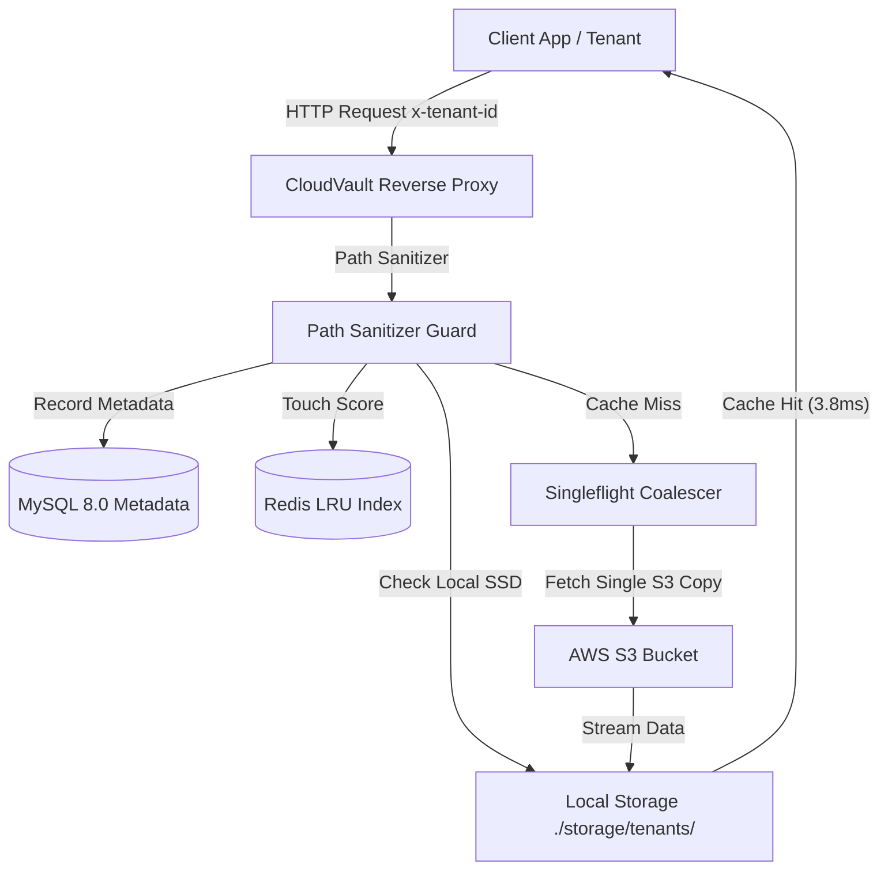

# 🚀 CloudVault - Multi-Tenant Cloud Storage Gateway & Proxy

[](https://nodejs.org/)
[](https://redis.io/)
[](https://aws.amazon.com/s3/)
[](https://www.mysql.com/)
[](https://www.docker.com/)

---

## 📌 What is CloudVault?

**CloudVault** is a high-performance **Storage Gateway & Reverse Proxy** that sits between your applications and **AWS S3**.

Instead of your clients downloading files directly from S3 (which is slow and incurs cloud egress costs), CloudVault acts as a **smart local cache and security firewall**.

- **First Download (Cache Miss):** Fetches the file from AWS S3, saves it to local disk storage, and streams it to the user (~180ms).
- **Subsequent Downloads (Cache Hit):** Serves the file directly from local NVMe/SSD storage (**~3.8ms — 48x faster!**).

---

## 💡 What Problems Does CloudVault Solve?

1. **⚡ Slow S3 Download Speeds:** Reduces file retrieval latency from **~200ms to ~3ms**.
2. **💰 High Cloud Egress Charges:** Cuts AWS data download fees by caching popular files locally.
3. **🛡️ Public S3 Exposure:** Keeps your AWS S3 bucket **100% private**. Clients never see S3 bucket URLs or AWS credentials.
4. **🔒 Multi-Tenant Data Leakage:** Restricts each tenant's access strictly to their isolated directory (`./storage/tenants/<tenantId>/`) and blocks path traversal (`../`) security attacks.
5. **🔥 Thundering Herd Problem:** If 50 users request the exact same missing file simultaneously, CloudVault downloads it from S3 **only ONCE** (Singleflight request coalescing) and streams it to all 50 users.

---

## 🏗️ System Architecture


```mermaid
graph TD;
    Client[Client App / Tenant]-->|HTTP Request x-tenant-id| Proxy[CloudVault Reverse Proxy];
    Proxy-->|Path Sanitizer| Security[Path Sanitizer Guard];
    Security-->|Check Local SSD| Disk[Local Storage ./storage/tenants/];
    Security-->|Record Metadata| MySQL[(MySQL 8.0 Metadata)];
    Security-->|Touch Score| Redis[(Redis LRU Index)];
    
    Disk-- Cache Hit (3.8ms) -->Client;
    
    Security-->|Cache Miss| Singleflight[Singleflight Coalescer];
    Singleflight-->|Fetch Single S3 Copy| S3[AWS S3 Bucket];
    S3-->|Stream Data| Disk;
```

---

## ☁️ AWS S3 & Multi-Tenant Storage Structure

### 1. S3 Key Path Organization
Files are stored neatly by tenant in your S3 bucket:
```text
s3://<S3_BUCKET_NAME>/tenants/<tenantId>/<filePath>
```
*Example:* `s3://my-cloudvault-bucket/tenants/tenant_101/documents/report.pdf`

### 2. Multi-Tenant Security Isolation
- **Tenant Header:** API calls require `x-tenant-id` (or path `/proxy/:tenantId/...`).
- **Database Partitioning:** MySQL tracks metadata by `tenant_id`. Tenant A cannot query Tenant B's files.
- **Path Traversal Guard:** `resolveTenantPath(tenantId, filePath)` uses `path.normalize` and `path.resolve` to prevent path traversal (`../`) attacks, returning a `SecurityError` (HTTP 403).

---

## ✨ Core Features

| Feature | Description |
| :--- | :--- |
| **📁 Direct Whole-File Tenant Storage** | Clean storage paths in S3 (`tenants/<tenantId>/<filePath>`) and local disk. |
| **🛡️ Multi-Tenant Path Sanitizer** | Blocks directory escape and path traversal (`../`) security attacks. |
| **🚀 Singleflight Request Coalescing** | Prevents S3 Thundering Herd on cache misses by merging concurrent requests. |
| **🧹 Redis LRU Eviction Watcher** | Background worker automatically deletes oldest local files when storage limit is reached. |
| **🔁 Transparent Storage Proxy** | Direct HTTP proxy routes (`/proxy/:tenantId/*`) with custom headers (`X-Cache-Status`). |
| **🐳 Fully Dockerized** | One-click setup for MySQL 8.0, Redis Alpine, and Node.js App container. |

---

## 🚀 Quick Start Guide

### 1. Environment Configuration (`.env`)
```env
PORT=3000
MYSQL_HOST=localhost
MYSQL_PORT=3306
MYSQL_USER=root
MYSQL_PASSWORD=root
MYSQL_DATABASE=cloudvault

REDIS_HOST=localhost
REDIS_PORT=6379

TENANTS_STORAGE_DIR=./storage/tenants

AWS_REGION=us-east-1
AWS_ACCESS_KEY_ID=your_access_key
AWS_SECRET_ACCESS_KEY=your_secret_key
S3_BUCKET_NAME=your_s3_bucket
```

### 2. Run with Docker Compose
```bash
docker-compose up --build -d
```

### 3. Run Automated Unit Tests
```bash
npm test
```

### 4. Run Latency & Speed Benchmark
```bash
npm run benchmark
```

**Benchmark Output:**
```text
======================================================
📊 BENCHMARK RESULTS SUMMARY
======================================================
☁️  First Download (S3 Cache Miss):    186.74 ms
🚀 Second Download (Local Cache Hit):   3.86 ms
⚡ Speed Improvement:                   48.4x FASTER!
======================================================
```

---

## 📡 Gateway & Proxy API Usage

### Upload via Storage Proxy (`PUT` / `POST`)
```bash
curl -X PUT "http://localhost:3000/proxy/tenant_101/documents/report.pdf" \
  --data-binary "@./sample.pdf"
```

### Download via Storage Proxy (`GET`)
```bash
curl -X GET "http://localhost:3000/proxy/tenant_101/documents/report.pdf" \
  -i --output downloaded_report.pdf
```

---

## 👨‍💻 Author
**S Vinay**
