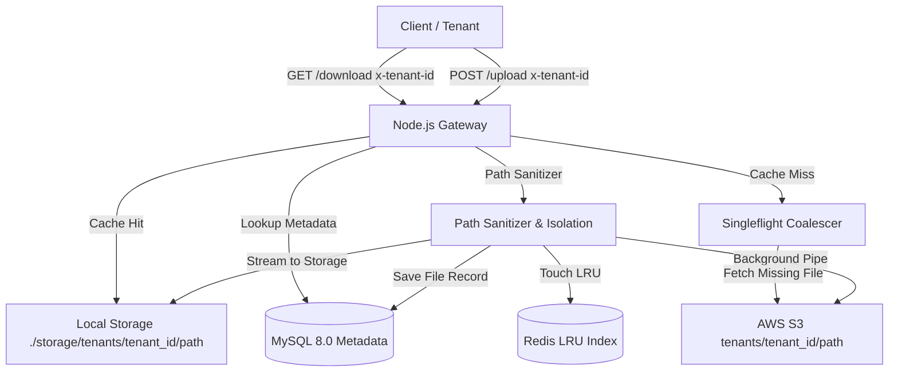

# 🚀 CloudVault: Multi-Tenant Hybrid-Cloud Storage Gateway

    

**CloudVault** is a high-performance **Multi-Tenant Storage Gateway** that acts as an intelligent caching layer between client applications and **AWS S3**. It provides fast local caching, **Multi-Tenant Path Isolation**, **Singleflight Request Coalescing**, and an automated **Redis LRU Eviction Watcher**.

---

## 🏗️ System Architecture


```mermaid
graph TD;
    User[Client / Tenant]-->|POST /upload x-tenant-id| API[Node.js Gateway];
    API-->|Path Sanitizer| Security[Path Sanitizer & Isolation];
    Security-->|Stream to Storage| Disk[Local Storage ./storage/tenants/tenant_id/path];
    Security-->|Save File Record| MySQL[(MySQL 8.0 Metadata)];
    Security-->|Background Pipe| S3[AWS S3 tenants/tenant_id/path];
    Security-->|Touch LRU| Redis[(Redis LRU Index)];
    
    User-->|GET /download x-tenant-id| API;
    API-->|Lookup Metadata| MySQL;
    API-->|Cache Hit| Disk;
    API-->|Cache Miss| Singleflight[Singleflight Coalescer];
    Singleflight-->|Fetch Missing File| S3;
```

---

## ☁️ AWS S3 Storage & Multi-Tenancy Architecture

### 1. Where & How Data is Stored in AWS S3
- Files are stored directly as whole files organized neatly per tenant.
- **S3 Key Path Structure:**
  `s3://<S3_BUCKET_NAME>/tenants/<tenantId>/<filePath>`
- **Example:**
  `s3://my-cloudvault-bucket/tenants/tenant_101/documents/report.pdf`
- This makes files easy to locate and inspect directly in the AWS S3 Console.

### 2. How Multi-Tenant Isolation Works
- **Tenant Header (`x-tenant-id`):** Every API request requires a tenant identifier in the `x-tenant-id` header.
- **MySQL Metadata Isolation:** File records are partitioned by tenant in MySQL (`tenant_id`, `file_path`, `file_name`, `size_bytes`, `s3_key`). Tenant A can only query and retrieve files belonging to `tenant_id = 'tenant_A'`.
- **Path Sanitization:** The `resolveTenantPath(tenantId, filePath)` utility uses `path.normalize` and `path.resolve` to enforce boundaries under `./storage/tenants/<tenantId>/`. Any path traversal (`../`) attempt immediately throws a `SecurityError` (HTTP 403).

---

## ✨ Key Features

- **📁 Direct Whole-File Tenant Storage:** Clean storage paths in S3 and local disk.
- **🛡️ Multi-Tenant Path Sanitizer:** Prevents directory escape and path traversal attacks (`SecurityError`).
- **🚀 Singleflight Request Coalescing:** Eliminates Thundering Herd problems on S3 cache misses by coalescing concurrent requests into a single S3 download.
- **🧹 Redis LRU Eviction Watcher:** Background worker monitors folder size and automatically evicts least recently used local files when cache limit is exceeded.
- **🐳 Fully Dockerized:** One-click deployment for MySQL 8.0, Redis Alpine, and Node.js App container.

---

## 🛠️ Tech Stack

- **Backend:** Node.js (ES Modules), Express, Streams API
- **Database:** MySQL 8.0 (File Metadata), Redis (LRU Scoring Index)
- **Cloud Storage:** AWS S3 (`@aws-sdk/client-s3`, `@aws-sdk/lib-storage`)
- **Infrastructure:** Docker, Docker Compose

---

## 🚀 Getting Started

### 1. Environment Variables (.env)
```env
PORT=3000
MYSQL_HOST=localhost
MYSQL_PORT=3306
MYSQL_USER=root
MYSQL_PASSWORD=root
MYSQL_DATABASE=cloudvault

REDIS_HOST=localhost
REDIS_PORT=6379

TENANTS_STORAGE_DIR=./storage/tenants

AWS_REGION=us-east-1
AWS_ACCESS_KEY_ID=your_access_key
AWS_SECRET_ACCESS_KEY=your_secret_key
S3_BUCKET_NAME=your_s3_bucket
```

### 2. Run with Docker Compose
```bash
docker-compose up --build -d
```

### 3. Run Unit Tests
```bash
npm test
```

### 4. Run Performance & Latency Benchmark
```bash
npm run benchmark
```

---

## 👨‍💻 Author
S Vinay
