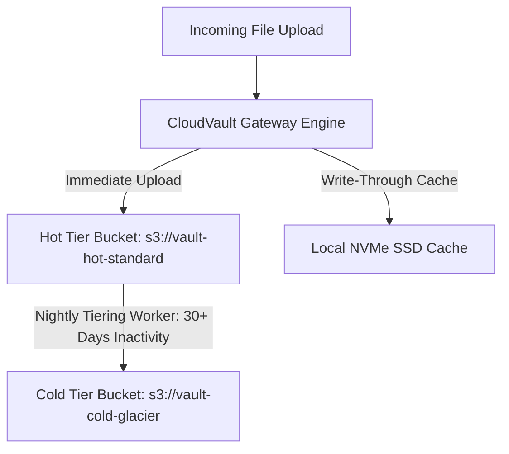
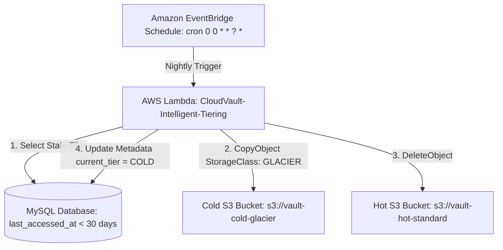
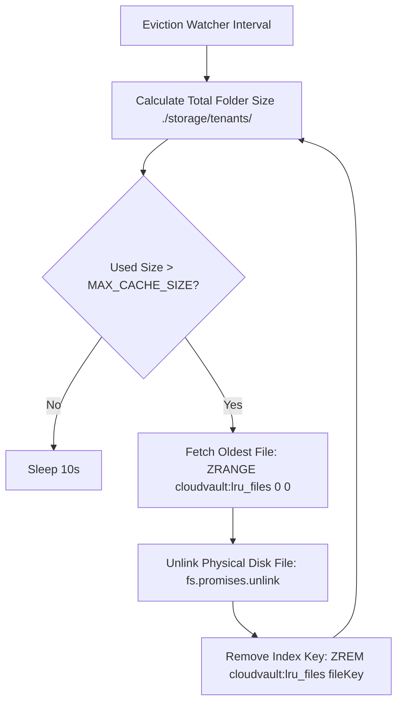

# 🚀 CloudVault - Multi-Tenant Storage Gateway & Reverse Proxy

[](https://nodejs.org/)
[](https://redis.io/)
[](https://aws.amazon.com/s3/)
[](https://www.mysql.com/)
[](https://www.docker.com/)

---

## 📌 What is CloudVault?

**CloudVault** is a high-performance **Storage Gateway & Reverse Proxy** that sits between your client applications and **AWS S3**.

Instead of client apps downloading files directly from S3 (which is slow and incurs cloud egress fees), CloudVault acts as an intelligent **local caching proxy, multi-bucket tiering manager, and security firewall**.

- **First Download (Cache Miss):** Fetches the file from AWS S3, saves it to local disk storage, and streams it to the user (~180ms).
- **Subsequent Downloads (Cache Hit):** Serves the file directly from local NVMe/SSD storage (**~3.8ms — 48x faster!**).

---

## 🧊 Intelligent Storage Tiering (Multi-Bucket Movement)

Instead of dumping everything into one expensive AWS S3 Standard bucket, CloudVault intelligently routes and migrates data across multiple S3 buckets based on access frequency and age.


```mermaid
graph TD;
    Upload[Incoming File Upload]-->Gateway[CloudVault Gateway Engine];
    Gateway-->|Immediate Upload| Hot[Hot Tier Bucket: s3://vault-hot-standard];
    Gateway-->|Write-Through Cache| Local[Local NVMe SSD Cache];
    
    Hot-->|Nightly Tiering Worker: 30+ Days Inactivity| Cold[Cold Tier Bucket: s3://vault-cold-glacier];
```

### 1. Dual-Bucket Architecture Comparison

| Tier | Storage Target | Cost per GB/mo | Read Latency | Primary Purpose |
| :--- | :--- | :--- | :--- | :--- |
| **Hot Tier** | `s3://vault-hot-standard` | ~$0.023 | ~100-200ms | Active files, frequent downloads |
| **Cold Tier** | `s3://vault-cold-glacier` | ~$0.004 (80% cheaper) | Minutes / Hours | Historical archives, stale tenant files |

### 2. How the Intelligent Tiering Algorithm Works

CloudVault controls data movement using a Hybrid Invalidation & Lifecycle Policy:

#### Step A: Metadata Tracking in MySQL
MySQL tracks tier status and access frequency:
```sql
ALTER TABLE files 
ADD COLUMN current_tier ENUM('HOT', 'COLD') DEFAULT 'HOT',
ADD COLUMN last_accessed_at TIMESTAMP DEFAULT CURRENT_TIMESTAMP,
ADD COLUMN access_count INT DEFAULT 1;
```

#### Step B: AWS Lambda Function & Amazon EventBridge Schedule (`src/lambda/tieringLambdaHandler.js`)
Nightly, an **Amazon EventBridge (CloudWatch Events)** schedule (`cron(0 0 * * ? *)`) triggers the standalone **AWS Lambda Function** ([src/lambda/tieringLambdaHandler.js](src/lambda/tieringLambdaHandler.js)):


```mermaid
graph TD;
    EventBridge[Amazon EventBridge Schedule: cron 0 0 * * ? *]-->|Nightly Trigger| Lambda[AWS Lambda: CloudVault-Intelligent-Tiering];
    Lambda-->|1. Select Stale Files| MySQL[(MySQL Database: last_accessed_at < 30 days)];
    Lambda-->|2. CopyObject StorageClass: GLACIER| ColdBucket[Cold S3 Bucket: s3://vault-cold-glacier];
    Lambda-->|3. DeleteObject| HotBucket[Hot S3 Bucket: s3://vault-hot-standard];
    Lambda-->|4. Update Metadata current_tier = COLD| MySQL;
```

1. **Copy Object:** Copies object from Hot Bucket to Cold Glacier Bucket (`CopyObjectCommand` with `StorageClass: 'GLACIER'`).
2. **Delete Object:** Deletes object from Hot Bucket (`DeleteObjectCommand`).
3. **Update Metadata:** Updates record in MySQL (`UPDATE files SET current_tier = 'COLD' WHERE id = ?`).

### 3. Transparent Read Routing on Cold Requests

When a user requests a file via `GET /proxy/:tenantId/file.pdf`:
- **Local Cache Hit:** Serves immediately from local NVMe (~3.8ms) regardless of cloud tier.
- **Cache Miss & Tier == 'HOT':** Downloads stream from Hot S3 Bucket (~186ms), caches to NVMe, serves to user.
- **Cache Miss & Tier == 'COLD':** Triggers an asynchronous S3 Restore Object job (`RestoreObjectCommand`) and returns an **HTTP 202 Accepted** response:
```json
{
  "status": "archived",
  "message": "File is being restored from Glacier cold storage. Available in local cache within 3-5 hours.",
  "s3Key": "tenants/tenant_101/documents/archive.pdf"
}
```

---

## 🔄 How CloudVault Acts as a Reverse Proxy

CloudVault operates as a **Reverse Storage Proxy** for AWS S3:

1. **Shielding AWS Infrastructure & Credentials:** Clients never possess AWS Access Keys (`AWS_ACCESS_KEY_ID`, `AWS_SECRET_ACCESS_KEY`) or direct S3 bucket URLs. The S3 bucket remains **100% private**.
2. **Transparent HTTP Proxy Routes (`/proxy/:tenantId/*`):**
   - **Upload (`PUT` / `POST`):** Client streams file to `http://gateway:3000/proxy/tenant_101/docs/report.pdf`. CloudVault writes to local cache, records MySQL metadata, and pipes data in the background to AWS S3 Hot Bucket.
   - **Download (`GET`):** Client requests `http://gateway:3000/proxy/tenant_101/docs/report.pdf`. Serves local SSD cache on Hit (`X-Cache-Status: CACHE_HIT`) or fetches from S3 Hot Bucket on Miss (`X-Cache-Status: CACHE_MISS_S3_FETCH`).
   - **Delete (`DELETE`):** Client sends `DELETE /proxy/tenant_101/docs/report.pdf`. CloudVault removes the file from local SSD, MySQL metadata, and Redis LRU tracking.

---

## 🗄️ Database Schema (MySQL 8.0)

### `files` Table Schema

```sql
CREATE TABLE IF NOT EXISTS files (
  id INT AUTO_INCREMENT PRIMARY KEY,
  tenant_id VARCHAR(255) NOT NULL,
  file_path VARCHAR(768) NOT NULL,
  file_name VARCHAR(255) NOT NULL,
  size_bytes BIGINT NOT NULL,
  s3_key VARCHAR(1024) NOT NULL,
  current_tier ENUM('HOT', 'COLD') DEFAULT 'HOT',
  last_accessed_at TIMESTAMP DEFAULT CURRENT_TIMESTAMP,
  access_count INT DEFAULT 1,
  created_at TIMESTAMP DEFAULT CURRENT_TIMESTAMP,
  UNIQUE KEY idx_tenant_path (tenant_id, file_path)
) ENGINE=InnoDB DEFAULT CHARSET=utf8mb4;
```

---

## ⚡ What Redis Stores & LRU Scoring

- **Redis Key:** `cloudvault:lru_files` (Sorted Set `ZSET`)
- **Member Format:** `${tenantId}:${filePath}`
- **Score:** Unix timestamp in milliseconds (`Date.now()`)

---

## 🧹 How Automatic Eviction Works (Redis LRU Watcher)


```mermaid
flowchart TD
    A[Eviction Watcher Interval] --> B[Calculate Total Folder Size ./storage/tenants/]
    B --> C{Used Size > MAX_CACHE_SIZE?}
    C -- No --> D[Sleep 10s]
    C -- Yes --> E[Fetch Oldest File: ZRANGE cloudvault:lru_files 0 0]
    E --> F[Unlink Physical Disk File: fs.promises.unlink]
    F --> G[Remove Index Key: ZREM cloudvault:lru_files fileKey]
    G --> B
```

---

## 🔒 Multi-Tenant Security Matrix

| Threat Vector | Defense Mechanism | Implementation |
| :--- | :--- | :--- |
| **Path Traversal (`../`)** | Path Sanitizer | `resolveTenantPath` with `path.normalize` & `path.resolve` check. |
| **Cross-Tenant Data Read** | Database Partitioning | MySQL metadata queries strictly filter `WHERE tenant_id = ?`. |
| **S3 Credential Leakage** | Reverse Proxy Shielding | AWS credentials remain server-side; S3 bucket is 100% private. |
| **Thundering Herd Overload** | Request Coalescing | `singleflightService` merges concurrent S3 requests. |

---

## 🚀 Quick Start & Benchmarking

### 1. Environment Configuration (`.env`)
```bash
cp .env.example .env
```

### 2. Run with Docker Compose
```bash
docker-compose up --build -d
```

### 3. Run Automated Unit Tests
```bash
npm test
```

### 4. Run Latency Benchmark
```bash
npm run benchmark
```

---

## 👨‍💻 Author
**S Vinay**
