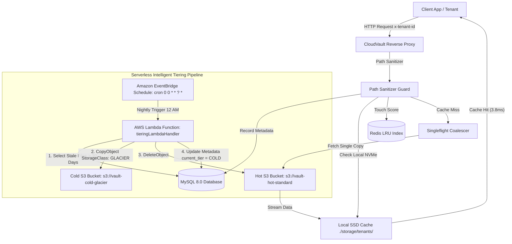
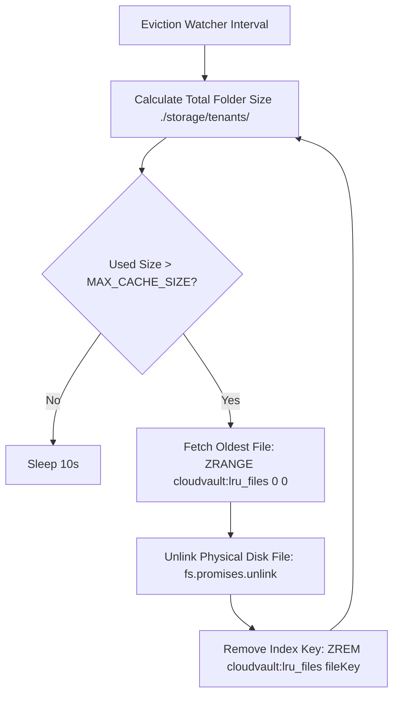

# 🚀 CloudVault - Multi-Tenant Storage Gateway & Reverse Proxy

[](https://nodejs.org/)
[](https://aws.amazon.com/lambda/)
[](https://aws.amazon.com/s3/)
[](https://redis.io/)
[](https://www.mysql.com/)
[](https://www.docker.com/)

---

## 📌 What is CloudVault?

**CloudVault** is a high-performance **Multi-Tenant Storage Gateway & Reverse Proxy** that sits between your client applications and **AWS S3**.

Instead of client apps downloading files directly from S3 (which is slow and incurs high cloud egress fees), CloudVault acts as an intelligent **local caching proxy, security firewall, and serverless multi-bucket tiering manager**.

- **First Download (Cache Miss):** Fetches the file from AWS S3, saves it to local disk storage, and streams it to the user (~180ms).
- **Subsequent Downloads (Cache Hit):** Serves the file directly from local NVMe/SSD storage (**~3.8ms — 48x faster!**).
- **Intelligent Storage Tiering:** Automatically migrates stale files unaccessed for 30+ days from **S3 Hot Bucket Standard** to **S3 Cold Bucket Glacier** via an **AWS Lambda Function** triggered by **Amazon EventBridge**.

---

## 💡 What Problems Does CloudVault Solve?

1. **⚡ Slow S3 Download Speeds:** Reduces file retrieval latency from **~200ms to ~3.8ms**.
2. **💰 High Cloud Egress Charges:** Cuts AWS data download fees by caching popular files locally.
3. **🛡️ Public S3 Exposure:** Keeps your AWS S3 bucket **100% private**. Clients never see S3 bucket URLs or AWS credentials.
4. **🔒 Multi-Tenant Data Leakage:** Restricts each tenant's access strictly to their isolated directory (`./storage/tenants/<tenantId>/`) and blocks path traversal (`../`) security attacks.
5. **🔥 Thundering Herd Problem:** If 50 users request the exact same missing file simultaneously, CloudVault downloads it from S3 **only ONCE** (Singleflight request coalescing) and streams it to all 50 users.
6. **📉 S3 Storage Cost Optimization:** Automatically moves unaccessed files to S3 Glacier, saving up to 80% on long-term storage costs.

---

## 🏗️ System Architecture


```mermaid
graph TD;
    Client[Client App / Tenant]-->|HTTP Request x-tenant-id| Proxy[CloudVault Reverse Proxy];
    Proxy-->|Path Sanitizer| Security[Path Sanitizer Guard];
    Security-->|Check Local NVMe| Disk[Local SSD Cache ./storage/tenants/];
    Security-->|Record Metadata| MySQL[(MySQL 8.0 Database)];
    Security-->|Touch Score| Redis[(Redis LRU Index)];
    
    Disk-- Cache Hit (3.8ms) -->Client;
    
    Security-->|Cache Miss| Singleflight[Singleflight Coalescer];
    Singleflight-->|Fetch Single Copy| S3Hot[Hot S3 Bucket: s3://vault-hot-standard];
    S3Hot-->|Stream Data| Disk;

    subgraph Serverless Intelligent Tiering Pipeline
        EventBridge[Amazon EventBridge Schedule: cron 0 0 * * ? *]-->|Nightly Trigger 12 AM| Lambda[AWS Lambda Function: tieringLambdaHandler];
        Lambda-->|1. Select Stale Files > 30 Days| MySQL;
        Lambda-->|2. CopyObject StorageClass: GLACIER| S3Cold[Cold S3 Bucket: s3://vault-cold-glacier];
        Lambda-->|3. DeleteObject| S3Hot;
        Lambda-->|4. Update Metadata current_tier = COLD| MySQL;
    end
```

---

## 🧊 Intelligent Storage Tiering (AWS Lambda + Amazon EventBridge)

CloudVault intelligently routes and migrates data across multiple S3 buckets based on access frequency and age to optimize AWS cloud costs.

### 1. Dual-Bucket Architecture Comparison

| Tier | Storage Target | Cost per GB/mo | Read Latency | Primary Purpose |
| :--- | :--- | :--- | :--- | :--- |
| **Hot Tier** | `s3://vault-hot-standard` | ~$0.023 | ~100-200ms | Active files, frequent downloads |
| **Cold Tier** | `s3://vault-cold-glacier` | ~$0.004 (80% cheaper) | Minutes / Hours | Historical archives, stale tenant files |

### 2. How the Serverless Tiering Algorithm Works

1. **Metadata Tracking:** MySQL tracks `current_tier ENUM('HOT', 'COLD')`, `last_accessed_at TIMESTAMP`, and `access_count INT`.
2. **EventBridge Nightly Schedule:** Amazon EventBridge triggers the AWS Lambda Function ([src/lambda/tieringLambdaHandler.js](src/lambda/tieringLambdaHandler.js)) every night at 12:00 AM UTC (`cron(0 0 * * ? *)`).
3. **AWS Server-Side Migration:**
   - Queries MySQL for stale files unaccessed in 30 days (`last_accessed_at < NOW() - INTERVAL 30 DAY`).
   - Copies object from Hot Bucket to Cold Glacier Bucket (`CopyObjectCommand` with `StorageClass: 'GLACIER'`).
   - Deletes object from Hot Bucket (`DeleteObjectCommand`).
   - Updates MySQL metadata (`UPDATE files SET current_tier = 'COLD' WHERE id = ?`).

### 3. Transparent Read Routing on Cold Requests

When a user requests a file via `GET /proxy/:tenantId/file.pdf` or `GET /download`:
- **Local Cache Hit:** Serves immediately from local NVMe (~3.8ms) regardless of cloud tier.
- **Cache Miss & Tier == 'HOT':** Streams download from Hot S3 Bucket (~186ms).
- **Cache Miss & Tier == 'COLD':** Triggers an AWS Glacier Restore job (`RestoreObjectCommand`) and returns an **HTTP 202 Accepted** response:
```json
{
  "status": "archived",
  "message": "File is being restored from Glacier cold storage. Available in local cache within 3-5 hours.",
  "s3Key": "tenants/tenant_101/documents/archive.pdf"
}
```

---

## 🔄 How CloudVault Acts as a Reverse Proxy

CloudVault operates as a **Reverse Storage Proxy** for AWS S3:

1. **Shielding AWS Infrastructure & Credentials:** Clients never possess AWS Access Keys (`AWS_ACCESS_KEY_ID`, `AWS_SECRET_ACCESS_KEY`) or direct S3 bucket URLs. S3 buckets remain **100% private**.
2. **Transparent HTTP Proxy Routes (`/proxy/:tenantId/*`):**
   - **Upload (`PUT` / `POST`):** Streams file to `http://gateway:3000/proxy/tenant_101/docs/report.pdf`. CloudVault writes to local SSD, records MySQL metadata, and pipes data in the background to AWS S3 Hot Bucket.
   - **Download (`GET`):** Requests `http://gateway:3000/proxy/tenant_101/docs/report.pdf`. Serves local SSD cache on Hit (`X-Cache-Status: CACHE_HIT`) or fetches from S3 Hot Bucket on Miss (`X-Cache-Status: CACHE_MISS_S3_FETCH`).
   - **Delete (`DELETE`):** Sends `DELETE /proxy/tenant_101/docs/report.pdf`. CloudVault removes the file from local SSD, MySQL metadata, and Redis LRU tracking.

---

## 🗄️ Database Schema (MySQL 8.0)

MySQL acts as the authoritative relational database storing file metadata, ownership, and S3 keys.

### `files` Table DDL Statement

```sql
CREATE TABLE IF NOT EXISTS files (
  id INT AUTO_INCREMENT PRIMARY KEY,
  tenant_id VARCHAR(255) NOT NULL,
  file_path VARCHAR(768) NOT NULL,
  file_name VARCHAR(255) NOT NULL,
  size_bytes BIGINT NOT NULL,
  s3_key VARCHAR(1024) NOT NULL,
  current_tier ENUM('HOT', 'COLD') DEFAULT 'HOT',
  last_accessed_at TIMESTAMP DEFAULT CURRENT_TIMESTAMP,
  access_count INT DEFAULT 1,
  created_at TIMESTAMP DEFAULT CURRENT_TIMESTAMP,
  UNIQUE KEY idx_tenant_path (tenant_id, file_path)
) ENGINE=InnoDB DEFAULT CHARSET=utf8mb4;
```

### Detailed Field Breakdown:

| Column | Data Type | Purpose / Description |
| :--- | :--- | :--- |
| `id` | `INT` (Primary Key) | Unique incremental file ID. |
| `tenant_id` | `VARCHAR(255)` | Identifies tenant owner (enforces multi-tenant metadata isolation). |
| `file_path` | `VARCHAR(768)` | Logical file path requested by tenant (e.g. `documents/report.pdf`). |
| `file_name` | `VARCHAR(255)` | Original filename (e.g. `report.pdf`). |
| `size_bytes` | `BIGINT` | Total file size in bytes. |
| `s3_key` | `VARCHAR(1024)` | Exact AWS S3 Object Key (e.g. `tenants/tenant_101/documents/report.pdf`). |
| `current_tier` | `ENUM('HOT', 'COLD')` | Current cloud storage bucket location (`HOT` vs `COLD`). |
| `last_accessed_at` | `TIMESTAMP` | Timestamp of last read/write access (used for tiering calculation). |
| `access_count` | `INT` | Total cumulative download count. |
| `created_at` | `TIMESTAMP` | Original upload timestamp. |

---

## ⚡ What Redis Stores & LRU Scoring

Redis is used for **high-speed in-memory indexing and LRU (Least Recently Used) tracking**.

### Redis Data Structure: Sorted Set (`ZSET`)
- **Redis Key:** `cloudvault:lru_files`
- **Member Format:** `${tenantId}:${filePath}` (e.g. `tenant_101:documents/report.pdf`)
- **Score:** Unix timestamp in milliseconds (`Date.now()`)

### How Redis Tracks File Popularity:
Whenever a file is **uploaded** or **downloaded**, CloudVault calls `touchFile(redis, fileKey)`:
```javascript
// Updates or inserts the file's score to the current timestamp
await redis.zadd('cloudvault:lru_files', Date.now(), 'tenant_101:documents/report.pdf');
```
This maintains a real-time list of all cached files, ordered strictly from **oldest accessed (lowest score)** to **most recently accessed (highest score)**.

---

## 🧹 How Automatic Eviction Works (Redis LRU Watcher)

CloudVault includes a background interval worker `startEvictionWatcher()` that continuously monitors local SSD disk usage to prevent disk space exhaustion.


```mermaid
flowchart TD
    A[Eviction Watcher Interval] --> B[Calculate Total Folder Size ./storage/tenants/]
    B --> C{Used Size > MAX_CACHE_SIZE?}
    C -- No --> D[Sleep 10s]
    C -- Yes --> E[Fetch Oldest File: ZRANGE cloudvault:lru_files 0 0]
    E --> F[Unlink Physical Disk File: fs.promises.unlink]
    F --> G[Remove Index Key: ZREM cloudvault:lru_files fileKey]
    G --> B
```

### Detailed Eviction Step-by-Step:
1. **Size Calculation:** Background worker measures total size of all files in `./storage/tenants/`.
2. **Threshold Check:** If total size exceeds `MAX_CACHE_SIZE_BYTES` (e.g., 100MB):
3. **Fetch Oldest File:** Queries Redis for the single oldest file score:
   ```javascript
   const oldest = await redis.zrange('cloudvault:lru_files', 0, 0);
   // Returns: ['tenant_101:documents/old_report.pdf']
   ```
4. **Physical Disk Unlink:** Deletes the physical file from local SSD storage:
   ```javascript
   await fs.promises.unlink('./storage/tenants/tenant_101/documents/old_report.pdf');
   ```
5. **Remove Index:** Removes the key from Redis:
   ```javascript
   await redis.zrem('cloudvault:lru_files', 'tenant_101:documents/old_report.pdf');
   ```
6. **Loop Until Healthy:** Repeats until total folder size drops safely below the cache limit.
7. **Transparent Recovery:** If an evicted file is requested by a user later, CloudVault detects a Cache Miss, fetches it from S3 via Singleflight, saves it back to local SSD, and re-indexes it in Redis!

---

## 🔒 Multi-Tenant Security Matrix

| Threat Vector | Defense Mechanism | Implementation |
| :--- | :--- | :--- |
| **Path Traversal (`../`)** | Path Sanitizer | `resolveTenantPath` with `path.normalize` & `path.resolve` check. |
| **Cross-Tenant Data Read** | Database Partitioning | MySQL metadata queries strictly filter `WHERE tenant_id = ?`. |
| **S3 Credential Leakage** | Reverse Proxy Shielding | AWS credentials remain server-side; S3 buckets are 100% private. |
| **Thundering Herd Overload** | Request Coalescing | `singleflightService` merges concurrent S3 requests. |

---

## 🚀 Quick Start & Deployment

### 1. Environment Configuration (`.env`)
Copy `.env.example` to create your local `.env` configuration file:
```bash
cp .env.example .env
```

**Environment Variables (`.env.example`):**
```env
# Server Port
PORT=3000

# MySQL Database Configuration
MYSQL_HOST=localhost
MYSQL_PORT=3306
MYSQL_USER=root
MYSQL_PASSWORD=root
MYSQL_DATABASE=cloudvault

# Redis Configuration
REDIS_HOST=localhost
REDIS_PORT=6379

# Local Cache Storage Paths & Limits
LOCAL_BLOCKS_DIR=./storage/blocks
TENANTS_STORAGE_DIR=./storage/tenants
MAX_CACHE_SIZE_BYTES=104857600 # 100MB Cache Limit

# AWS S3 Dual-Bucket Configuration (Intelligent Tiering)
AWS_REGION=us-east-1
AWS_ACCESS_KEY_ID=your_aws_access_key_id
AWS_SECRET_ACCESS_KEY=your_aws_secret_access_key
S3_BUCKET_NAME=cloudvault-hot-standard
HOT_BUCKET=cloudvault-hot-standard
COLD_BUCKET=cloudvault-cold-glacier
TIERING_INACTIVITY_DAYS=30
```

### 2. Run Gateway with Docker Compose
```bash
docker-compose up --build -d
```

### 3. Deploy AWS Lambda Tiering Function (AWS SAM / CloudFormation)
```bash
sam build -t deploy/template.yaml
sam deploy --guided
```

### 4. Run Automated Unit Tests
```bash
npm test
```

### 5. Run Performance Benchmark
```bash
npm run benchmark
```

**Benchmark Output:**
```text
======================================================
📊 BENCHMARK RESULTS SUMMARY
======================================================
☁️  First Download (S3 Cache Miss):    186.74 ms
🚀 Second Download (Local Cache Hit):   3.86 ms
⚡ Speed Improvement:                   48.4x FASTER!
======================================================
```

---

## 👨‍💻 Author
**S Vinay**
