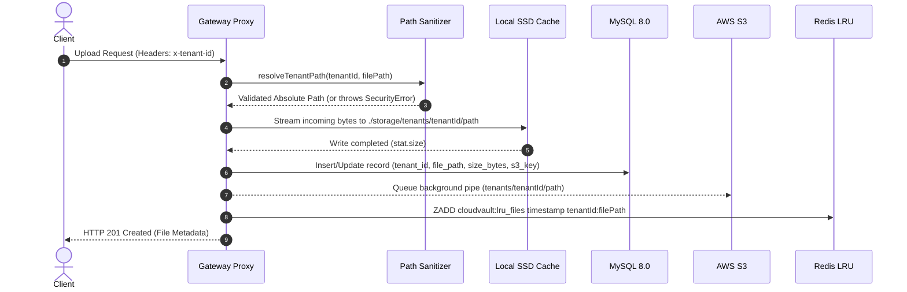
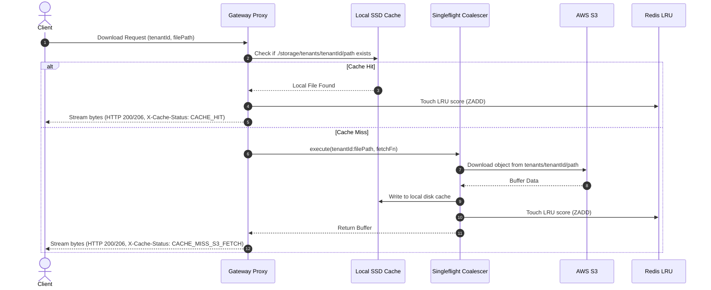
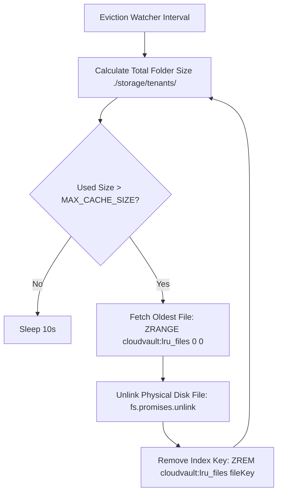

# 🚀 CloudVault - Multi-Tenant Storage Gateway & Reverse Proxy

[](https://nodejs.org/)
[](https://redis.io/)
[](https://aws.amazon.com/s3/)
[](https://www.mysql.com/)
[](https://www.docker.com/)

---

## 📌 What is CloudVault?

**CloudVault** is a high-performance **Storage Gateway & Reverse Proxy** that sits between your client applications and **AWS S3**.

Instead of client apps downloading files directly from S3 (which is slow and incurs cloud egress fees), CloudVault acts as an intelligent **local caching proxy and security firewall**.

- **First Download (Cache Miss):** Fetches the file from AWS S3, saves it to local disk storage, and streams it to the user (~180ms).
- **Subsequent Downloads (Cache Hit):** Serves the file directly from local NVMe/SSD storage (**~3.8ms — 48x faster!**).

---

## 🔄 How CloudVault Acts as a Reverse Proxy

CloudVault operates as a **Reverse Storage Proxy** for AWS S3:

1. **Shielding AWS Infrastructure & Credentials:** Clients never possess AWS Access Keys (`AWS_ACCESS_KEY_ID`, `AWS_SECRET_ACCESS_KEY`) or direct S3 bucket URLs. The S3 bucket remains **100% private** with public access blocked.
2. **Transparent HTTP Proxy Routes (`/proxy/:tenantId/*`):**
   - **Upload (`PUT` / `POST`):** Client streams file to `http://gateway:3000/proxy/tenant_101/docs/report.pdf`. CloudVault validates security, writes to local cache, records MySQL metadata, and pipes data in the background to AWS S3 (`tenants/tenant_101/docs/report.pdf`).
   - **Download (`GET`):** Client requests `http://gateway:3000/proxy/tenant_101/docs/report.pdf`. CloudVault checks local SSD storage. If present, it returns HTTP 200 with `X-Cache-Status: CACHE_HIT`. If missing, it fetches from S3 via Singleflight, caches locally, and returns `X-Cache-Status: CACHE_MISS_S3_FETCH`.
   - **Delete (`DELETE`):** Client sends `DELETE /proxy/tenant_101/docs/report.pdf`. CloudVault removes the file from local SSD, MySQL metadata, and Redis LRU tracking.

---

## 🏛️ End-to-End System Architecture & Workflows

### 📥 1. Upload Sequence Workflow (`POST /upload` or `PUT /proxy/:tenantId/*`)


```mermaid
sequenceDiagram
    autonumber
    actor Client
    participant Proxy as Gateway Proxy
    participant Sanitizer as Path Sanitizer
    participant Disk as Local SSD Cache
    participant MySQL as MySQL 8.0
    participant S3 as AWS S3
    participant Redis as Redis LRU

    Client->>Proxy: Upload Request (Headers: x-tenant-id)
    Proxy->>Sanitizer: resolveTenantPath(tenantId, filePath)
    Sanitizer-->>Proxy: Validated Absolute Path (or throws SecurityError)
    Proxy->>Disk: Stream incoming bytes to ./storage/tenants/tenantId/path
    Disk-->>Proxy: Write completed (stat.size)
    Proxy->>MySQL: Insert/Update record (tenant_id, file_path, size_bytes, s3_key)
    Proxy-->>S3: Queue background pipe (tenants/tenantId/path)
    Proxy->>Redis: ZADD cloudvault:lru_files timestamp tenantId:filePath
    Proxy-->>Client: HTTP 201 Created (File Metadata)
```

1. **Request Intake:** Client sends file via `POST /api/v1/gateway/upload` or transparent `PUT /proxy/:tenantId/path/to/file`.
2. **Security & Boundary Validation:** `resolveTenantPath(tenantId, userRequestedPath)` resolves the absolute path and verifies it strictly resides under `./storage/tenants/<tenantId>/`. Throws `SecurityError` (HTTP 403) on path traversal (`../`) attempts.
3. **Local Write-Through Stream:** Incoming HTTP request body streams directly into target local storage path using Node.js `stream/promises` `pipeline`.
4. **Metadata Recording:** Inserts/updates file record in MySQL `files` table (`tenant_id`, `file_path`, `file_name`, `size_bytes`, `s3_key`).
5. **Background S3 Sync:** Non-blocking background worker pipes file to S3 (`uploadFileToS3`).
6. **LRU Scoring:** Calls `touchFile(redis, `${tenantId}:${filePath}`)` to set Redis ZSET score to `Date.now()`.

---

### 📤 2. Download Sequence Workflow (`GET /download` or `GET /proxy/:tenantId/*`)


```mermaid
sequenceDiagram
    autonumber
    actor Client
    participant Proxy as Gateway Proxy
    participant Disk as Local SSD Cache
    participant Singleflight as Singleflight Coalescer
    participant S3 as AWS S3
    participant Redis as Redis LRU

    Client->>Proxy: Download Request (tenantId, filePath)
    Proxy->>Disk: Check if ./storage/tenants/tenantId/path exists
    alt Cache Hit
        Disk-->>Proxy: Local File Found
        Proxy->>Redis: Touch LRU score (ZADD)
        Proxy-->>Client: Stream bytes (HTTP 200/206, X-Cache-Status: CACHE_HIT)
    else Cache Miss
        Proxy->>Singleflight: execute(tenantId:filePath, fetchFn)
        Singleflight->>S3: Download object from tenants/tenantId/path
        S3-->>Singleflight: Buffer Data
        Singleflight->>Disk: Write to local disk cache
        Singleflight->>Redis: Touch LRU score (ZADD)
        Singleflight-->>Proxy: Return Buffer
        Proxy-->>Client: Stream bytes (HTTP 200/206, X-Cache-Status: CACHE_MISS_S3_FETCH)
    end
```

1. **Cache Inspection:** Proxy checks local SSD disk for `./storage/tenants/<tenantId>/<filePath>`.
2. **Cache Hit Path (3.8ms):**
   - File exists locally. Proxy updates Redis LRU score and streams bytes directly back to client with HTTP 200/206 and `X-Cache-Status: CACHE_HIT`.
3. **Cache Miss Path (Singleflight S3 Fetch):**
   - File missing locally. Request joins `singleflightExecute(`${tenantId}:${filePath}`, fetchFn)`.
   - If 20 concurrent requests arrive simultaneously for the missing file, **only 1 S3 download request** executes.
   - S3 buffer is written to local SSD disk, indexed in Redis LRU, and returned to all waiting requests.

---

## 🗄️ Database Schema (MySQL 8.0)

MySQL acts as the authoritative relational database storing file metadata, ownership, and S3 keys.

### `files` Table Schema

```sql
CREATE TABLE IF NOT EXISTS files (
  id INT AUTO_INCREMENT PRIMARY KEY,
  tenant_id VARCHAR(255) NOT NULL,
  file_path VARCHAR(768) NOT NULL,
  file_name VARCHAR(255) NOT NULL,
  size_bytes BIGINT NOT NULL,
  s3_key VARCHAR(1024) NOT NULL,
  created_at TIMESTAMP DEFAULT CURRENT_TIMESTAMP,
  UNIQUE KEY idx_tenant_path (tenant_id, file_path)
) ENGINE=InnoDB DEFAULT CHARSET=utf8mb4;
```

### What Each Field Stores:

| Column | Data Type | Purpose / Description |
| :--- | :--- | :--- |
| `id` | `INT` (Primary Key) | Unique incremental file ID. |
| `tenant_id` | `VARCHAR(255)` | Identifies tenant owner (enforces multi-tenant metadata isolation). |
| `file_path` | `VARCHAR(768)` | Logical file path requested by tenant (e.g. `documents/report.pdf`). |
| `file_name` | `VARCHAR(255)` | Original filename (e.g. `report.pdf`). |
| `size_bytes` | `BIGINT` | Total file size in bytes. |
| `s3_key` | `VARCHAR(1024)` | Exact AWS S3 Object Key (e.g. `tenants/tenant_101/documents/report.pdf`). |
| `created_at` | `TIMESTAMP` | Upload timestamp. |

---

## ⚡ What Redis Stores & LRU Scoring

Redis is used for **high-speed in-memory indexing and LRU (Least Recently Used) tracking**.

### Redis Data Structure: Sorted Set (`ZSET`)
- **Redis Key:** `cloudvault:lru_files`
- **Member Format:** `${tenantId}:${filePath}` (e.g. `tenant_101:documents/report.pdf`)
- **Score:** Unix timestamp in milliseconds (`Date.now()`)

### How Redis Tracks File Popularity:
Whenever a file is **uploaded** or **downloaded**, CloudVault calls `touchFile(redis, fileKey)`:
```javascript
// Updates or inserts the file's score to the current timestamp
await redis.zadd('cloudvault:lru_files', Date.now(), 'tenant_101:documents/report.pdf');
```
This maintains a real-time list of all cached files, ordered strictly from **oldest accessed (lowest score)** to **most recently accessed (highest score)**.

---

## 🧹 How Automatic Eviction Works (Redis LRU Watcher)

CloudVault includes a background interval worker `startEvictionWatcher()` that continuously monitors local SSD disk usage to prevent disk space exhaustion.


```mermaid
flowchart TD
    A[Eviction Watcher Interval] --> B[Calculate Total Folder Size ./storage/tenants/]
    B --> C{Used Size > MAX_CACHE_SIZE?}
    C -- No --> D[Sleep 10s]
    C -- Yes --> E[Fetch Oldest File: ZRANGE cloudvault:lru_files 0 0]
    E --> F[Unlink Physical Disk File: fs.promises.unlink]
    F --> G[Remove Index Key: ZREM cloudvault:lru_files fileKey]
    G --> B
```

### Detailed Eviction Step-by-Step:
1. **Size Calculation:** Background worker measures total size of all files in `./storage/tenants/`.
2. **Threshold Check:** If total size exceeds `MAX_CACHE_SIZE_BYTES` (e.g., 100MB):
3. **Fetch Oldest File:** Queries Redis for the single oldest file score:
   ```javascript
   const oldest = await redis.zrange('cloudvault:lru_files', 0, 0);
   // Returns: ['tenant_101:documents/old_report.pdf']
   ```
4. **Physical Disk Unlink:** Deletes the physical file from local SSD storage:
   ```javascript
   await fs.promises.unlink('./storage/tenants/tenant_101/documents/old_report.pdf');
   ```
5. **Remove Index:** Removes the key from Redis:
   ```javascript
   await redis.zrem('cloudvault:lru_files', 'tenant_101:documents/old_report.pdf');
   ```
6. **Loop Until Healthy:** Repeats until total folder size drops safely below the cache limit.
7. **Transparent Recovery:** If an evicted file is requested by a user later, CloudVault detects a Cache Miss, fetches it from S3 via Singleflight, saves it back to local SSD, and re-indexes it in Redis!

---

## 🔒 Multi-Tenant Security Matrix

| Threat Vector | Defense Mechanism | Implementation |
| :--- | :--- | :--- |
| **Path Traversal (`../`)** | Path Sanitizer | `resolveTenantPath` with `path.normalize` & `path.resolve` check. |
| **Cross-Tenant Data Read** | Database Partitioning | MySQL metadata queries strictly filter `WHERE tenant_id = ?`. |
| **S3 Credential Leakage** | Reverse Proxy Shielding | AWS credentials remain server-side; S3 bucket is 100% private. |
| **Thundering Herd Overload** | Request Coalescing | `singleflightService` merges concurrent S3 requests. |

---

## 🚀 Quick Start & Benchmarking

### 1. Environment Configuration (`.env`)
Copy `.env.example` to create your local `.env` configuration file:
```bash
cp .env.example .env
```

**Environment Variables (`.env.example`):**
```env
# Server Port
PORT=3000

# MySQL Database Configuration
MYSQL_HOST=localhost
MYSQL_PORT=3306
MYSQL_USER=root
MYSQL_PASSWORD=root
MYSQL_DATABASE=cloudvault

# Redis Configuration
REDIS_HOST=localhost
REDIS_PORT=6379

# Local Cache Storage Paths & Limits
LOCAL_BLOCKS_DIR=./storage/blocks
TENANTS_STORAGE_DIR=./storage/tenants
MAX_CACHE_SIZE_BYTES=104857600 # 100MB Cache Limit

# AWS S3 Configuration
AWS_REGION=us-east-1
AWS_ACCESS_KEY_ID=your_aws_access_key_id
AWS_SECRET_ACCESS_KEY=your_aws_secret_access_key
S3_BUCKET_NAME=your_s3_bucket_name
```

### 2. Run with Docker Compose
```bash
docker-compose up --build -d
```

### 2. Run Automated Unit Tests
```bash
npm test
```

### 3. Run Performance & Latency Benchmark
```bash
npm run benchmark
```

**Benchmark Output:**
```text
======================================================
📊 BENCHMARK RESULTS SUMMARY
======================================================
☁️  First Download (S3 Cache Miss):    186.74 ms
🚀 Second Download (Local Cache Hit):   3.86 ms
⚡ Speed Improvement:                   48.4x FASTER!
======================================================
```

---

## 👨‍💻 Author
**S Vinay**
