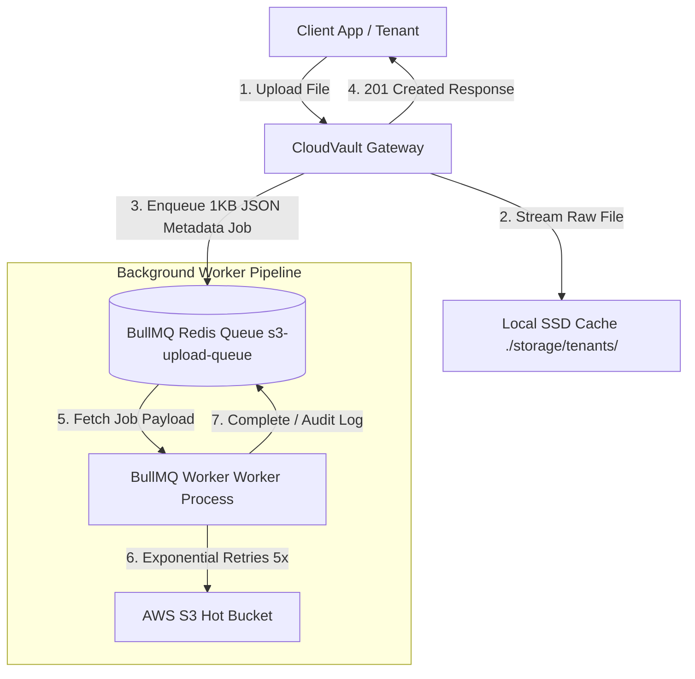

# 🌊 Streams & Asynchronous Background Processing in CloudVault

This document provides an architecture deep dive into how **CloudVault** handles high-throughput file transfers, streams data efficiently without choking server memory, processes background cloud synchronization via **BullMQ**, and handles RESTful uploads and chunked partial downloads.

---

## 📌 Executive Summary & Problem Statement

In traditional web applications, handling large file uploads (e.g., 500 MB to 10 GB videos, datasets, or backups) often leads to **Out-Of-Memory (OOM) crashes**, high server latency, and dropped network connections. 

CloudVault addresses these challenges using two architectural pillars:
1. **Node.js Streams (`stream.pipe`)**: Processes data as continuous byte chunks ($O(1)$ constant memory usage) rather than buffering whole files into server RAM ($O(N)$ memory bloat).
2. **BullMQ Redis Job Queue**: Decouples client HTTP responses from cloud synchronization, offering guaranteed background processing, automatic retries, rate-limited concurrency, and crash resilience.

---

## 1. 🌊 Streams vs. Traditional File Transfers

### Traditional File Transfers ($O(N)$ Memory Footprint)
In traditional web frameworks, when a user uploads a 5 GB file, the server reads the **entire 5 GB into RAM** before processing:

```javascript
// ❌ ANTI-PATTERN: Loading full file into server RAM Buffer
const fileBuffer = fs.readFileSync('large_video.mp4'); // Consumes 5GB RAM!
await s3.upload({ Body: fileBuffer });
```

#### Issues with Traditional File Transfer:
* **Server Crashes (OOM):** Concurrent uploads from 10 users uploading 1 GB files require **10 GB of server RAM**, immediately crashing containerized Node.js environments.
* **High Initial Latency:** The server cannot start uploading to cloud storage until 100% of the file has been received from the client.
* **Garbage Collection Pressure:** Allocating and freeing massive byte arrays causes heavy V8 garbage collection pauses, freezing the Event Loop.

---

### Stream-Based File Transfer ($O(1)$ Constant Memory)
CloudVault uses **Node.js Streams** (`stream.Readable`, `stream.Writable`, `stream.PassThrough`, `pipeline`):

```javascript
// ✅ CLOUDVAULT PATTERN: Streaming data chunk by chunk
const cloudStream = new PassThrough();
const diskStream = new PassThrough();

// Pipe incoming HTTP request stream directly to local disk and S3 simultaneously
fileStream.pipe(cloudStream); // Streams to AWS S3
fileStream.pipe(diskStream);  // Streams to Local SSD Disk Cache
```

#### Why Streams Solve File Transfer Issues:
| Metric | Traditional Transfer | Stream-Based Transfer (CloudVault) |
| :--- | :--- | :--- |
| **RAM Footprint** | $O(N)$ (Proportional to file size, e.g., 5 GB RAM) | $O(1)$ (Constant ~64 KB buffer per stream) |
| **Concurrency** | 1–5 concurrent large uploads max | 1,000+ concurrent active uploads per instance |
| **Time-to-First-Byte (TTFB)** | Slow (waits for full file buffer) | Near Instant (chunks transmit as they arrive) |
| **Backpressure Control** | None (memory expands continuously) | Built-in (pauses read stream if write buffer is full) |

---

## 2. ⚡ Asynchronous Background Processing & BullMQ Queue

### Why Unqueued Background Tasks Fail in Production
A naive asynchronous upload pattern runs unqueued background promises:

```javascript
// ⚠️ UNQUEUED FIRE-AND-FORGET (Risky in Production)
uploadFileToS3(s3Key, targetLocalPath).catch(err => console.warn(err));
return res.status(201).json({ message: "Uploaded" });
```

#### Production Vulnerabilities:
1. **Server Restarts / Deployments (Data Loss):** If the Gateway container restarts while background uploads are in progress, unqueued in-flight promises are terminated. The file remains on local disk but is **lost from S3**.
2. **Transient Network Errors:** If AWS S3 returns a `503 Service Unavailable` or rate-limit error, the upload fails permanently without retrying.
3. **Thundering Herd Memory Spikes:** If 500 files are uploaded at once, 500 concurrent background S3 uploads spawn simultaneously, choking network bandwidth and CPU.

---

### How BullMQ + Redis Solves Background Processing

CloudVault integrates **BullMQ** (a Redis-backed job queue framework) to manage background cloud sync:



#### Key Architecture Principles:
1. **Queue Persistence:** If the server restarts, Redis retains all pending S3 upload jobs. Upon booting up, the BullMQ worker picks up exactly where it left off.
2. **Exponential Backoff Retries:** On S3 network failures, BullMQ retries up to **5 times** with exponential backoff ($2\text{s}, 4\text{s}, 8\text{s}, 16\text{s}, 32\text{s}$).
3. **Controlled Concurrency:** BullMQ worker limits active parallel S3 streams (e.g., `concurrency: 5`), protecting network bandwidth and memory.
4. **Graceful Fallback:** If Redis is temporarily offline, CloudVault falls back to inline asynchronous execution without rejecting the client's HTTP request.

---

### What Gets Stored in the Queue?

> 💡 **Golden Rule:** **NEVER store binary files inside queues.**

BullMQ stores a small **JSON Metadata Pointer** (~1 KB payload):

```json
{
  "id": "s3-upload-tenant_101:documents_report.pdf",
  "name": "uploadFileToS3",
  "data": {
    "tenantId": "tenant_101",
    "filePath": "documents/report.pdf",
    "targetLocalPath": "/storage/tenants/tenant_101/documents/report.pdf",
    "s3Key": "tenants/tenant_101/documents/report.pdf",
    "bucketName": "cloudvault-hot-standard",
    "queuedAt": 1726613400000
  },
  "opts": {
    "attempts": 5,
    "backoff": {
      "type": "exponential",
      "delay": 2000
    }
  }
}
```

---

## 3. 📖 Complete API Reference & Transfer Mechanics

### 1. Transparent Storage Proxy (`/proxy/*`)

Acts as an edge reverse proxy concealing AWS credentials:

#### **Upload Proxy**
* **HTTP Method:** `PUT` / `POST`
* **Path:** `/proxy/:tenantId/path/to/file.ext`
* **Response Status:** `201 Created`
* **Behavior:** Streams body to local SSD disk, writes MySQL metadata record, enqueues BullMQ job for S3 sync.

#### **Download Proxy**
* **HTTP Method:** `GET`
* **Path:** `/proxy/:tenantId/path/to/file.ext`
* **Headers:** `Range: bytes=start-end` (Optional)
* **Response Status:** `200 OK` (Full Download) / `206 Partial Content` (Range Chunk) / `202 Accepted` (Glacier Cold Storage)
* **Response Headers:** `X-Cache-Status` (`CACHE_HIT` vs `CACHE_MISS_S3_FETCH`), `X-Storage-Tier` (`HOT` vs `COLD`).

#### **Delete Proxy**
* **HTTP Method:** `DELETE`
* **Path:** `/proxy/:tenantId/path/to/file.ext`
* **Response Status:** `200 OK` (Requires `ADMIN` role)

---

### 2. Authentication & RBAC Endpoints (`/api/v1/auth/*`)

CloudVault uses JWT Bearer Tokens (`Authorization: Bearer <token>`) or `x-api-key` headers:

| Method | Endpoint Path | Payload / Headers | Description |
| :--- | :--- | :--- | :--- |
| `POST` | `/api/v1/auth/token` | Body: `{ tenantId, role }` | Generates signed 24h JWT access token for tenant & role (`ADMIN`, `DEVELOPER`, `VIEWER`) |
| `GET` | `/api/v1/auth/me` | Header: `Authorization: Bearer <token>` | Decodes token and verifies active role and permissions |

#### Role Permission Matrix:
* **`ADMIN`**: Full permissions (`read`, `write`, `delete`, `invalidate`, `admin`). Can delete files & trigger cache invalidation.
* **`DEVELOPER`**: Read & Write permissions (`read`, `write`). Can upload & download files.
* **`VIEWER`**: Read-only permissions (`read`). Can download files & list directory contents.

---

### 3. Standard Gateway API (`/api/v1/gateway/*`)

Multi-tenant gateway endpoints with strict `x-tenant-id` header validation:

| Method | Endpoint Path | Headers / Query | Description |
| :--- | :--- | :--- | :--- |
| `POST` | `/api/v1/gateway/upload` | Header: `x-tenant-id`<br>Query/Header: `filePath` | Streams multipart form-data or raw body to local storage & enqueues S3 sync job |
| `GET` | `/api/v1/gateway/download` | Header: `x-tenant-id`<br>Query: `filePath` | Downloads file (serves from local SSD or singleflights from S3) |
| `GET` | `/api/v1/gateway/files` | Header: `x-tenant-id` | Lists all file records for tenant |
| `DELETE` | `/api/v1/gateway/files` | Header: `x-tenant-id`<br>Query: `filePath` | Unlinks local disk file & removes database record |
| `POST` | `/api/v1/gateway/invalidate` | Header: `x-tenant-id`<br>Query: `filePath` | Invalidates local disk cache for S3 updates |
| `POST` | `/api/v1/gateway/s3-event` | AWS S3 Event Notification Body | Webhook processing direct S3 `ObjectCreated` / `ObjectRemoved` events |

---

### 3. Chunked Partial Downloads (`HTTP 206 Partial Content`)

When clients request specific byte ranges (e.g. video seeking or resumable downloads):

```http
GET /api/v1/gateway/download?filePath=videos/tutorial.mp4 HTTP/1.1
Host: localhost:3000
x-tenant-id: tenant_101
Range: bytes=0-1048575
```

**Server Response:**
```http
HTTP/1.1 206 Partial Content
Content-Type: application/octet-stream
Content-Range: bytes 0-1048575/104857600
Content-Length: 1048576
Content-Disposition: attachment; filename="tutorial.mp4"

[1 MB Binary Data Slice]
```

---

### 4. Cold Storage (Glacier) Retrieval (`HTTP 202 Accepted`)

If a requested file is in **S3 Glacier Cold Storage** (`current_tier = 'COLD'`) and missing locally:

```http
HTTP/1.1 202 Accepted
Content-Type: application/json

{
  "status": "archived",
  "message": "File is being restored from Glacier cold storage. Available in local cache within 3-5 hours.",
  "s3Key": "tenants/tenant_101/archive/backup.tar.gz"
}
```

CloudVault automatically dispatches an AWS S3 `RestoreObjectCommand` to restore the object from Glacier to Standard storage.
